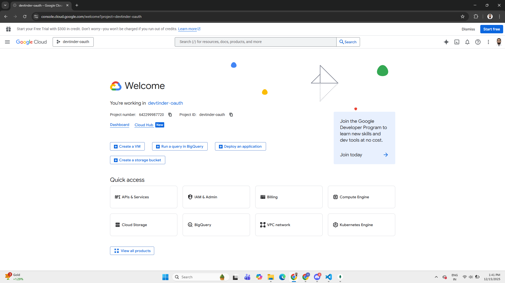
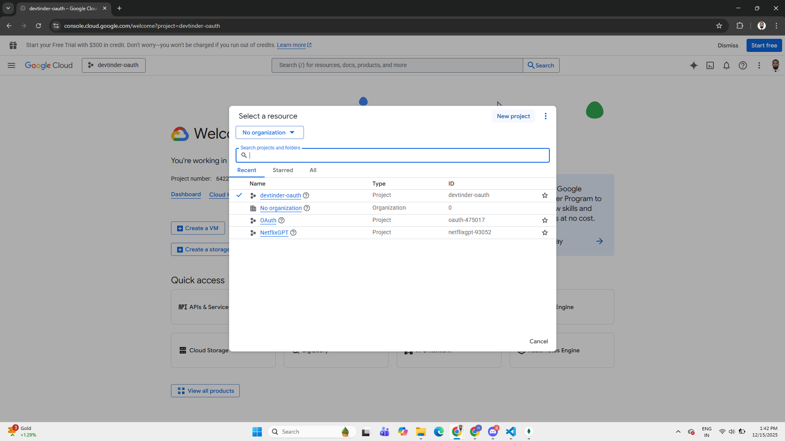
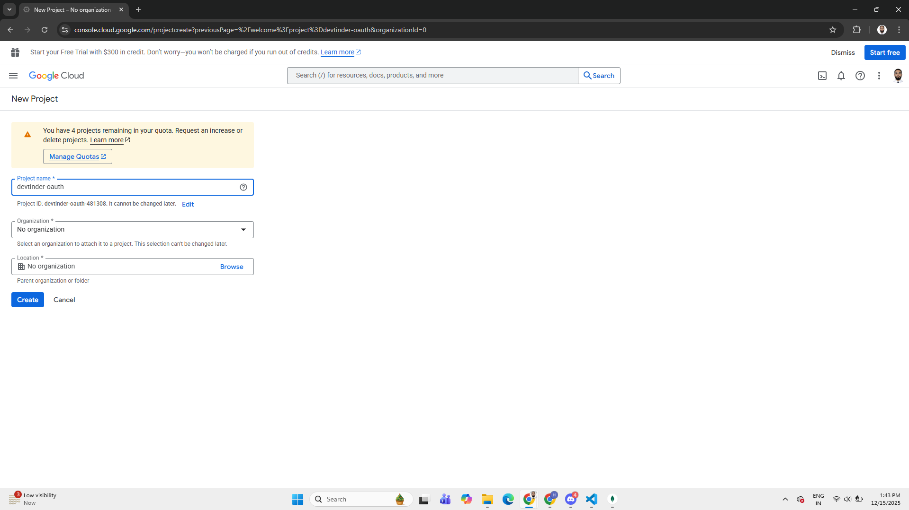
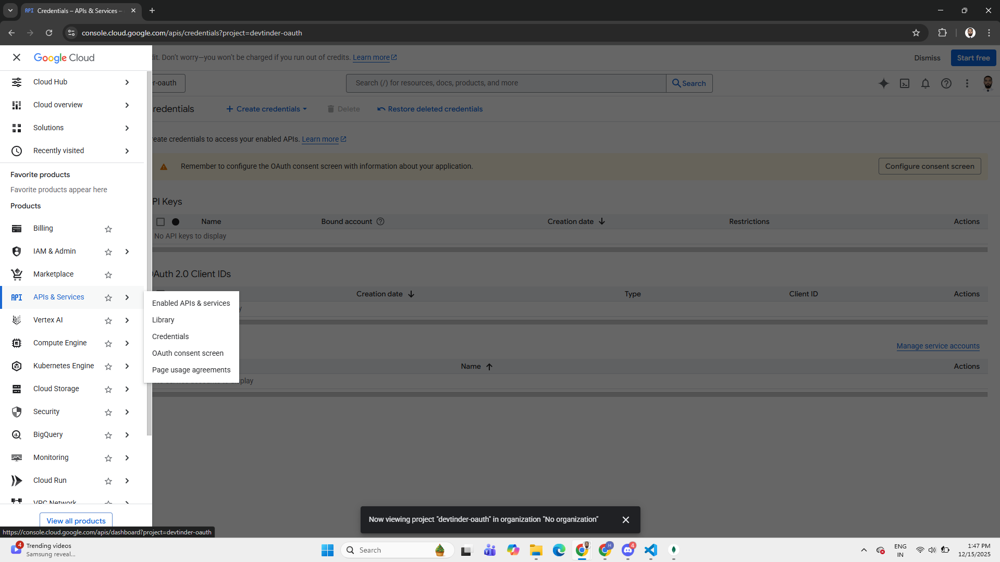
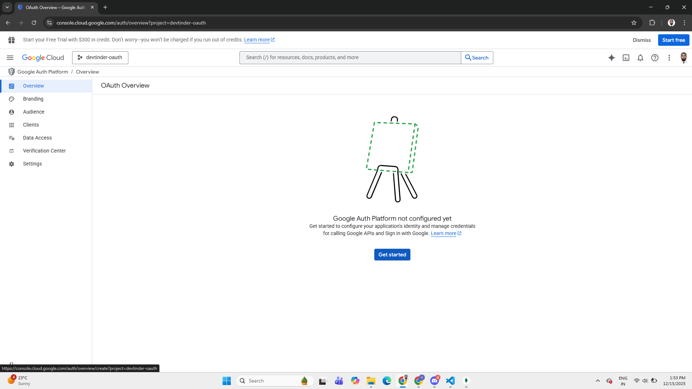
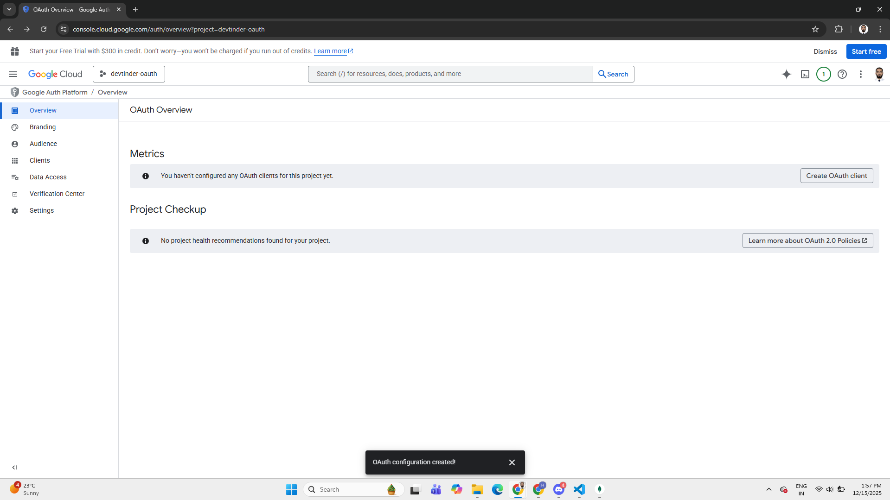
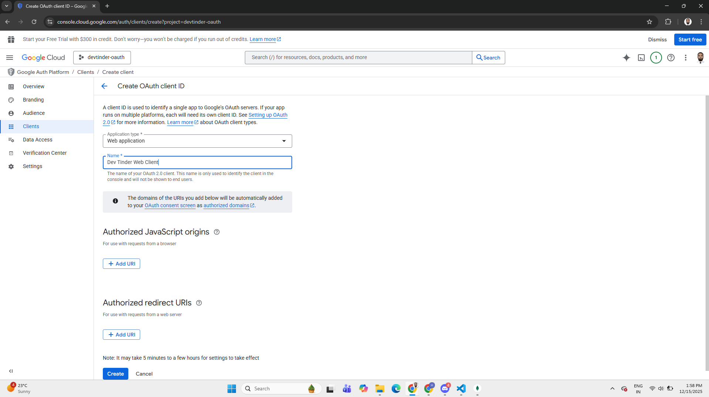
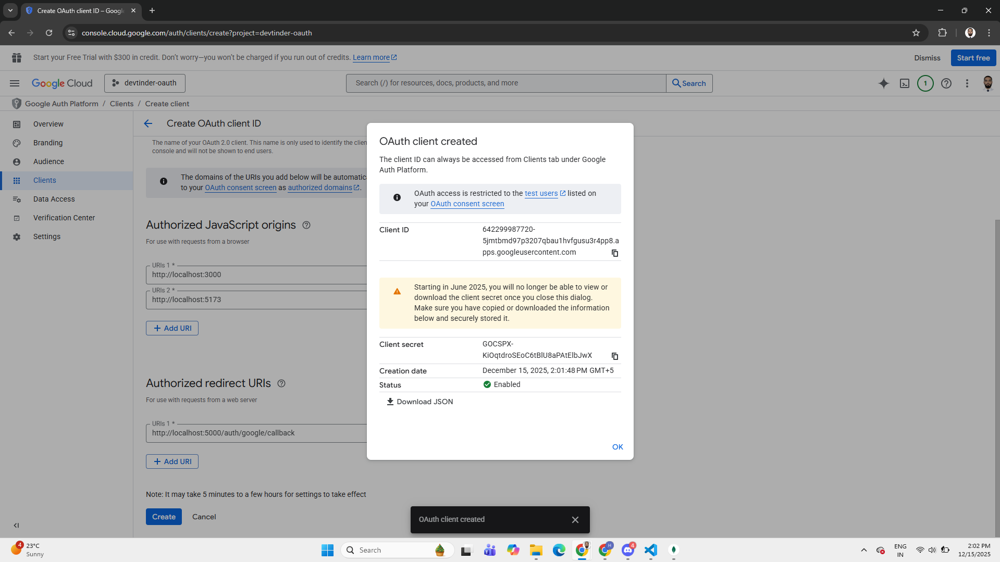

# OAuth - Google authentication ft. Backend
## Step 1. Setting up the Google Console Cloud
1. Go to the link [Console Cloud Google](https://console.cloud.google.com/).




2. Click on the `Project Picker` i.e. `devtinder-oauth`.




3. Click on `New Project` and `Create a new Project`.




4. Click on the `Navigation Menu` -> `APIs & Services` -> `Credentials`




5. Go to the `OAuth consent screen` and configure the OAuth Client ID.




6. Click on `Get Started` and do the configuration.


7. Now Create the Client by clicking on the Create OAuth Client






8. Now add the Authorized Javascript origins
```text
  http://localhost:3000
  http://localhost:5173
```

9.  Add the Authorized Redirect URLs
```text
  http://localhost:3000/google/callback
```



---

## Step 2. Schema Update - User Schema needs to be updated
- Add the following code to the password attribute of the User Schema.
- This means that the password will be required in the authentication without google.
```js
    password: {
        type: String,
        required: function () {
            return this.authProvider === "local";
        },
```

```js
    googleId: {
        type: String,
        unique: true,
        sparse: true
    },
    authProvider: {
        type: String,
        enum: ["local", "google"],
        default: "local"
    },
    avatar: {
        type: String
    }
```

- Validation Code will also be updated it should not run for the Google users, but it should run for google users.

```js
  userSchema.methods.validatePasswords = async function (passwordInputByUser) {
      /* Only local passwords will be validated Google Login users will not be validated */
      if(user.authProvider !== "local"){
          return false;
      }

      /* If no password is passed by the user then we will return false */
      if(!user.password){
          return false;
      }
  }
```

## Step 3. Dependencies should be installed
```bash
    npm install passport passport-google-oauth20
```

## Step 4. Environment Variables to be added to the .env file
- Now, we need to add the following variables in the .env file
```js
GOOGLE_CLIENT_ID = ""
GOOGLE_CLIENT_SECRET = ""

BACKEND_URL="http://localhost:3000"
FRONTEND_URL="http://localhost:5173"
```

## Step 5. Create the passport.js in the `utils/passport.js`
- Write the code in the passport.js
```js
const passport = require("passport");
const GoogleStrategy = require("passport-google-oauth20").Strategy;
const User = require("../models/user");

passport.use(
  new GoogleStrategy(
    {
      clientID: process.env.GOOGLE_CLIENT_ID,
      clientSecret: process.env.GOOGLE_CLIENT_SECRET,
      callbackURL: `${process.env.BACKEND_URL}/google/callback`,
    },
    async (accessToken, refreshToken, profile, done) => {
      try {
        const email = profile.emails?.[0]?.value;

        let user = await User.findOne({
          $or: [{ googleId: profile.id }, { emailId: email }],
        });

        if (!user) {
          user = await User.create({
            firstName: profile.name?.givenName || profile.displayName || "User",
            lastName: profile.name?.familyName || "",
            emailId: email,
            googleId: profile.id,
            authProvider: "google",
            avatar: profile.photos?.[0]?.value,
          });
        } else {
          if (!user.googleId) user.googleId = profile.id;
          user.authProvider = "google";
          if (!user.avatar) user.avatar = profile.photos?.[0]?.value;
          await user.save();
        }

        return done(null, user);
      } catch (err) {
        return done(err, null);
      }
    }
  )
);

module.exports = passport;
```

- Changed the URL to `${process.env.BACKEND_URL}/google/callback` from `${process.env.BACKEND_URL}/auth/google/callback`.

## Step 6. Enable the Passport in the main server file i.e. `app.js`
```js
const passport = require("passport");
require("./config/passport");

app.use(passport.initialize());
```

## Step 7. Add the OAuth router into the existing authRouter in `/routes/auth.js`
```js
const passport = require("passport");

authRouter.get(
    "/google",
    passport.authenticate("google",
        {
            scope: ["profile", "email"],
            session: false
        }
    )
);

authRouter.get(
    "/google/callback",
    passport.authenticate("google",
        {
            session: false,
            failureRedirect: `${process.env.FRONTEND_URL}/login`
        }
    ),
    async (req, res) => {
        try {
            const user = req.user;

            const token = await user.getJWT();

            res.cookie("token", token, {
                httpOnly: true,
                expires: new Date(Date.now() + 8 * 3600000),
                sameSite: "lax",
                secure: process.env.NODE_ENV === "production",
            });

            res.redirect(`${process.env.FRONTEND_URL}/oauth-success`);

        } catch (err) {
            res.redirect(`${process.env.FRONTEND_URL}/login`)
        }
    }
);
```

## Additional Changes
1. In the `/routes/auth.js` the `/logout` API is changed and the cookies clear is changed
```js
authRouter.post("/logout",
    async (req, res) => {
        res.clearCookie("token", {
            httpOnly: true,
            sameSite: "lax",
            secure: process.env.NODE_ENV === "production"
        });

        res.send("User has logged out successfully");
    }
);
```

2. In the `/signup` and the `/login` API the cookies object is changed.
```js
  res.cookie("token", token, { 
      httpOnly: true, 
      expires: new Date(Date.now() + 8 * 3600000),
      sameSite: "lax",
      secure: process.env.NODE_ENV === "production"
  });
```

## Step 8. Testing the Changes for the OAuth2.0
- Hit the URL - http://localhost:3000/google

---